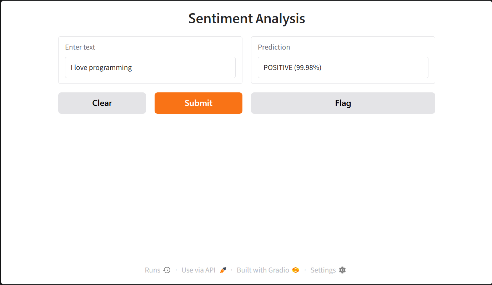

# Sentiment Analysis Gradio App

## Introduction

This is a simple **Sentiment Analysis web application** built with **Python, Hugging Face Transformers, and Gradio**.

The application takes text as input and uses a pre-trained NLP model to predict its sentiment. The result is displayed through an interactive Gradio interface.

## Screenshot



## Technologies Used

- **Python** — Application development
- **Hugging Face Transformers** — Sentiment analysis model
- **PyTorch** — Machine learning backend
- **Gradio** — Web interface

---

## How to Run
### 2. Create a Virtual Environment

A virtual environment keeps the project's Python dependencies isolated from other Python projects on your computer.

Create a virtual environment:

```bash
python -m venv venv
```

Then activate it.

**Windows:**

```powershell
venv\Scripts\activate
```

**macOS / Linux:**

```bash
source venv/bin/activate
```

### 3. Install Dependencies

Install the required packages:

```bash
pip install -r requirements.txt
```

### 4. Run the Application

After installing the dependencies, run the Python application:

```bash
python sentiment_analysis_gradio.py
```

Gradio will start the application and provide a local URL, usually similar to:

```text
http://127.0.0.1:7860
```

Open this URL in your browser to use the application.

### Quick Run

If you already have the required dependencies installed in your Python environment, you can simply run:

```bash
python sentiment_analysis_gradio.py
```

> **Recommended:** Use a virtual environment to avoid dependency conflicts with other Python projects.

### Prerequisites

Make sure **Python 3.10 or later** is installed.

Check your Python version:

```bash
python --version